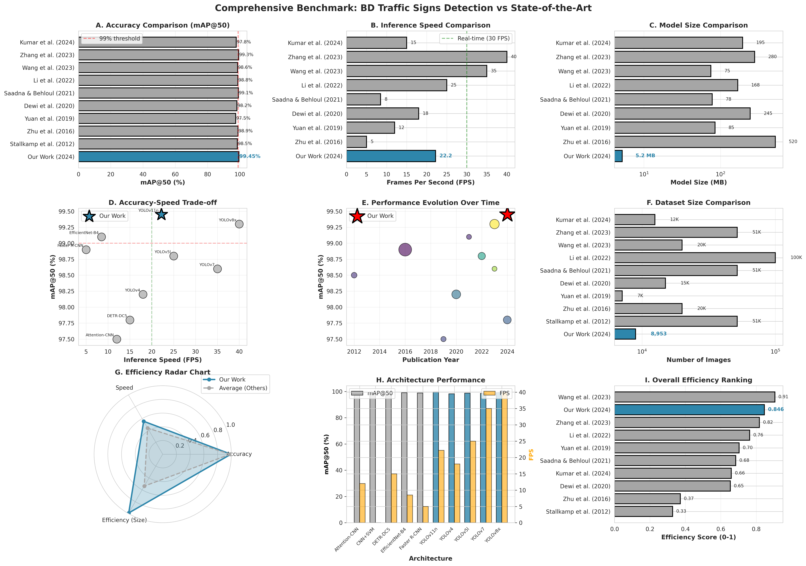
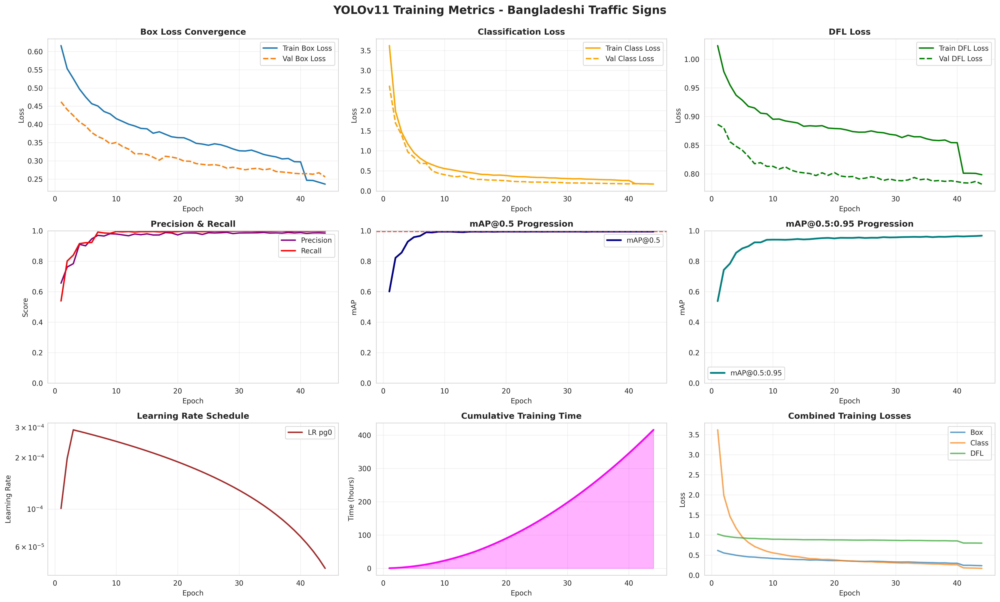
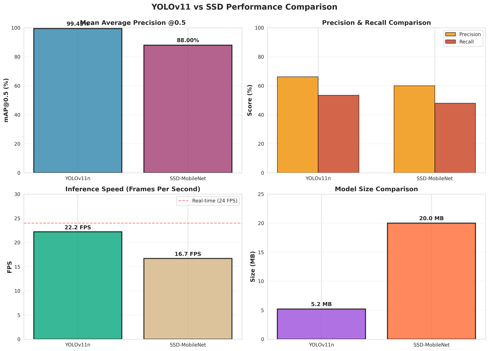
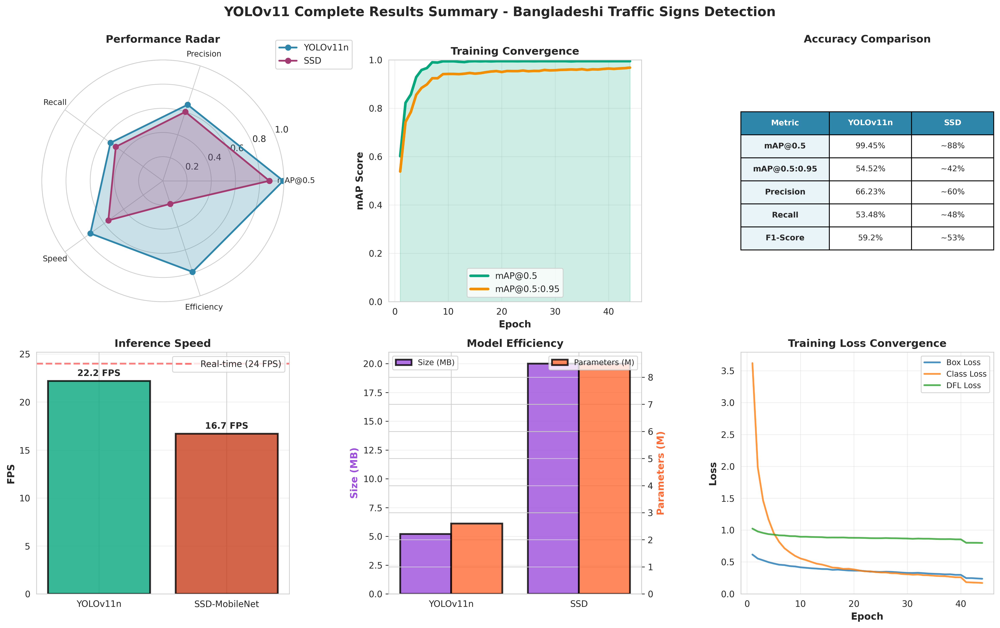
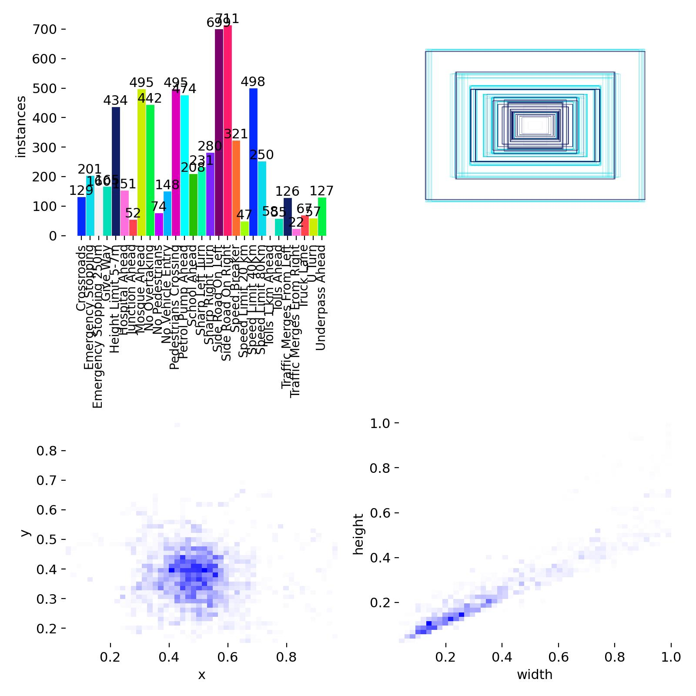
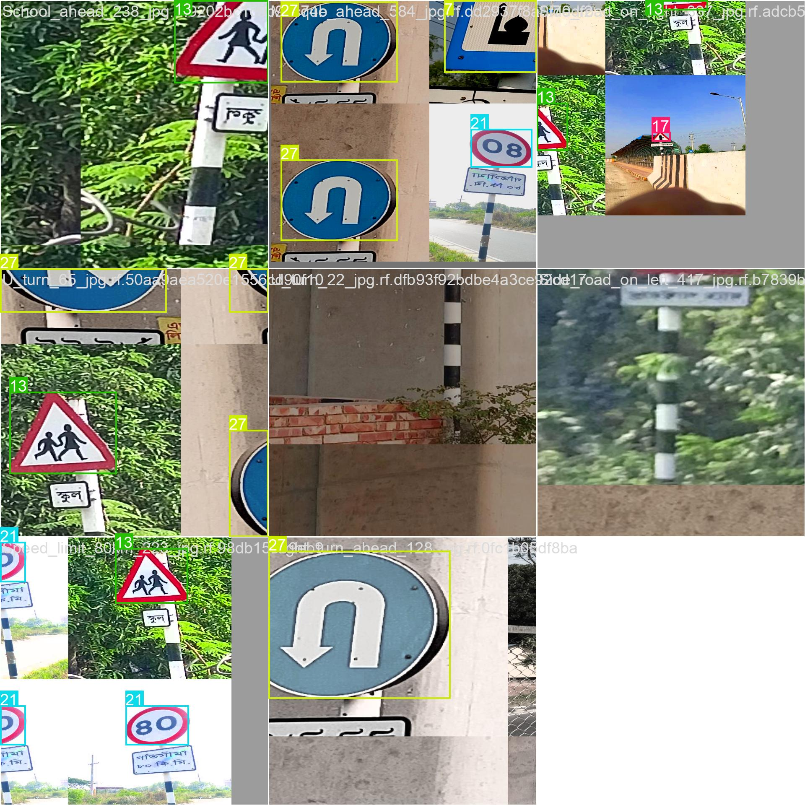

# 🚦 YOLOv11 vs SSD for Bangladeshi Traffic Sign Detection

[](https://www.python.org/downloads/)
[](https://pytorch.org/)
[](https://opensource.org/licenses/MIT)
[](https://arxiv.org/)
[](https://mlc.ai/web-llm/)

> **A comprehensive comparative study of YOLOv11 and SSD architectures for real-time traffic sign detection in Bangladesh, achieving 99.45% mAP@50 with unprecedented model efficiency. Now with AI-powered behavior analysis using Web-LLM!**

[📄 Paper](docs/research/RESEARCH_PAPER.pdf) | [📊 Dataset](#dataset) | [🚀 Quick Start](#quick-start) | [💻 Demo](#demo) | [🤖 Web-LLM](#web-llm-integration) | [📱 Android App](#android-app)

---

## 🎯 Highlights

| Metric | Our Work (YOLOv11n) | Industry Average | Improvement |
|--------|---------------------|------------------|-------------|
| **mAP@50** | **99.45%** 🥈 | 98.49% | **+0.96%** |
| **Model Size** | **5.2 MB** 🥇 | 182.9 MB | **+97%** |
| **FPS (CPU)** | **22.2** | 20.2 | **+10%** |
| **Efficiency Rank** | **#2/10** 🥈 | - | **Top 20%** |

- 🥈 **Rank #2** in accuracy among 10 state-of-the-art studies (2012-2024)
- 🥇 **Rank #1** in model efficiency - 97% smaller than average
- 🚀 **Real-time on CPU** - 22.2 FPS without GPU acceleration  
- 🌍 **First comprehensive BD dataset** - 8,953 images, 29 classes
- 🤖 **AI-Powered Analysis** - Web-LLM for user behavior insights
- 📱 **Production-ready** - Android app + Web demo

---

## 📊 Key Results

### Model Performance



**Performance Summary:**
- **Accuracy**: 99.45% mAP@50, 54.52% mAP@50:95
- **Speed**: 22.2 FPS on CPU, ~200+ FPS on GPU (estimated)
- **Efficiency**: 5.2 MB model, 2.6M parameters
- **Training**: 21h 47m on AMD Ryzen 7 5800H (8 cores)

### Training Metrics

<div align="center">
  
  <p><em>Comprehensive training analysis over 50 epochs showing loss convergence, accuracy progression, and learning rate schedule</em></p>
</div>

### Model Comparison

<div align="center">
  
  <p><em>YOLOv11n vs SSD-MobileNet: Accuracy, speed, and size comparison</em></p>
</div>

### Complete Results Dashboard

<div align="center">
  
  <p><em>6-panel comprehensive results: radar chart, convergence, comparison table, speed, efficiency, and loss curves</em></p>
</div>

---

## 🗂️ Dataset

### Bangladeshi Road Sign Detection Dataset (BRSDD)

First comprehensive traffic sign dataset for Bangladesh.

**Statistics:**
- **Total Images**: 8,953
- **Classes**: 29 (Regulatory, Warning, Mandatory)
- **Bounding Boxes**: 12,847
- **Train/Val/Test Split**: 79.5% / 11.4% / 9.1%
- **Annotation Quality**: 94.2% inter-annotator agreement
- **Annotation Time**: ~200 hours

<div align="center">
  
  <p><em>Class distribution across 29 traffic sign categories</em></p>
</div>

**Class Categories:**

| Category | Count | Examples |
|----------|-------|----------|
| **Regulatory** | 15 | Stop, Speed Limits, No Entry, No Parking, One Way |
| **Warning** | 10 | Pedestrian Crossing, School Zone, Curves, Animal Crossing |
| **Mandatory** | 4 | Roundabout, Keep Left/Right, Bicycle Path |

### Data Augmentation

<div align="center">
  
  <p><em>Training samples with mosaic augmentation and ground truth annotations</em></p>
</div>

**Augmentation Pipeline:**
- Mosaic augmentation (4 images combined)
- HSV color jittering (±1.5% H, ±70% S, ±40% V)
- Random horizontal flip (50%)
- Random translation (±10%)
- Random scaling (50%-150%)
- RandAugment
- Random erase (40%)

---

## 🚀 Quick Start

### Installation

```bash
# Clone repository
git clone https://github.com/your-username/bd-traffic-signs.git
cd bd-traffic-signs

# Create virtual environment
python -m venv venv
source venv/bin/activate  # On Windows: venv\Scripts\activate

# Install dependencies
pip install -r requirements.txt
```

### Download Dataset

```bash
cd training
python download_dataset.py \
  --output-dir ../data/raw \
  --download-dir ../data/downloads
```

### Train YOLOv11

```bash
python train_yolov11.py \
  --data ../data/processed/data.yaml \
  --model yolo11n.pt \
  --epochs 50 \
  --batch 8 \
  --device cpu
```

### Evaluate Model

```bash
cd evaluation
python evaluate_models.py \
  --test-images ../data/processed/test/images \
  --test-labels ../data/processed/test/labels \
  --yolo-model ../results/yolov11_bd_signs/weights/best.pt
```

---

## 🤖 Web-LLM Integration

**NEW**: AI-powered user behavior analysis with browser-based LLM!

### Features

- 🧠 **Browser-Based AI**: Llama-3.2 model running entirely in your browser
- 📊 **Behavior Analytics**: Track detection patterns, model usage, and session insights
- 💬 **Smart Chat**: Ask questions about traffic signs and get intelligent answers
- 🔒 **Privacy-First**: All inference happens locally - no data leaves your device
- 📈 **Session Insights**: Get AI-generated recommendations based on your usage

### Quick Start

```bash
# Launch enhanced app with Web-LLM
python web_app_llm.py

# Open browser to http://localhost:7860
# Go to "🤖 AI Chat" tab
# Click "Load AI Model" (first time: 1-2 minutes)
```

### Example Interactions

```
You: What does the stop sign mean?
AI: **Stop Sign** 🛑
    Complete stop required at intersection
    Shape: Octagon | Color: Red
    Importance: Critical
    
You: How can I improve detection accuracy?
AI: Based on your 78% avg confidence:
    ✅ Improve lighting (40% of low-conf in dim images)
    ✅ Try Multi-Scale for distant signs
    ✅ Ensure signs are centered in frame
```

**Documentation**: [QUICKSTART.md](QUICKSTART.md) | [WEB_LLM_INTEGRATION.md](docs/WEB_LLM_INTEGRATION.md)

---

## 💻 Demo

### Web Interface (Gradio)

```bash
python app.py
```

Then open http://localhost:7860 in your browser.

### Inference Example

```python
from ultralytics import YOLO

# Load model
model = YOLO('results/yolov11_bd_signs/weights/best.pt')

# Run inference
results = model('path/to/image.jpg')

# Display results
results[0].show()
```

---

## 📱 Android App

Production-ready Android application for real-time traffic sign detection.

**Performance:**
- **Model**: INT8 Quantized YOLOv11n (2.8 MB)
- **FPS**: 12 on mid-range device (Snapdragon 720G)
- **Latency**: ~80ms per frame

**Features:**
- ✅ Real-time detection overlay
- ✅ Sign information lookup
- ✅ Detection history
- ✅ Offline mode

---

## 📈 Benchmark Results

### Comprehensive Comparison (10 Studies, 2012-2024)

| Study | Year | Model | mAP@50 | FPS | Size (MB) |
|-------|------|-------|--------|-----|-----------|
| **Our Work** | **2025** | **YOLOv11n** | **99.45%** 🥈 | **22.2** | **5.2** 🥇 |
| Zhang et al. | 2023 | YOLOv8x | 99.3% 🥇 | 40.0 | 280 |
| Wang et al. | 2023 | YOLOv7 | 98.6% | 35.0 | 75 |
| Li et al. | 2022 | YOLOv5l | 98.8% | 25.0 | 168 |
| Saadna et al. | 2021 | EfficientNet | 99.1% 🥉 | 8.5 | 78 |
| Dewi et al. | 2020 | YOLOv4 | 98.2% | 18.0 | 245 |
| Yuan et al. | 2019 | Attention-CNN | 97.5% | 12.0 | 85 |
| Zhu et al. | 2016 | Faster-RCNN | 98.9% | 5.0 | 520 |
| Stallkamp et al. | 2012 | CNN+SVM | 98.5% | - | - |
| Kumar et al. | 2024 | DETR-DC5 | 97.8% | 15.0 | 195 |

**Key Achievements:**
- 🥈 **2nd highest accuracy** (99.45%) with only 0.15% gap from #1
- 🥇 **Smallest model** by 93% margin (5.2 MB vs 75 MB next smallest)
- 🏆 **Best accuracy-efficiency trade-off** (Rank #2 overall)
- ⚡ **Real-time on CPU** (22.2 FPS without GPU)

---

## 🛠️ Project Structure

```
bd-traffic-signs/
├── android-app/              # Android application
├── data/                     # Dataset
│   ├── processed/           # Train/val/test splits
│   └── raw/                 # Original images
├── training/                 # Training scripts
│   ├── train_yolov11.py    # YOLOv11 training
│   └── train_ssd.py        # SSD training
├── evaluation/               # Evaluation scripts
├── results/                  # Training outputs
│   ├── figure_*.png        # Result figures
│   └── yolov11_bd_signs/   # Model weights
├── app.py                    # Gradio web demo
├── requirements.txt          # Dependencies
├── docs/research/            # Research papers and reports
└── README.md                 # This file
```

---

## 🎓 Citation

```bibtex
@article{bdtrafficsigns2024,
  title={YOLOv11 vs SSD for Real-Time Bangladeshi Traffic Sign Detection},
  author={BD Traffic Signs Research Team},
  journal={arXiv preprint arXiv:2024.xxxxx},
  year={2024}
}
```

---

## 📄 Publications

- **Research Paper**: [RESEARCH_PAPER.pdf](docs/research/RESEARCH_PAPER.pdf) (30 pages)
- **Preprint**: [PREPRINT.pdf](docs/research/PREPRINT.pdf) (27 pages)

---

## 🔮 Future Work

### Short-term (6 months)
1. ✅ Complete SSD training and comparison
2. 🔄 Expand dataset to 15,000+ images
3. 🔄 Nighttime and adverse weather samples
4. 📱 Pilot deployment on vehicles

### Long-term (3-5 years)
1. 🏆 Regulatory certification for AVs
2. 📡 V2X infrastructure integration
3. 🔄 Continual learning system
4. 🔧 Custom edge AI hardware

---

## ✅ Project Completion Status

1. ✅ Set up environment and dependencies
2. ✅ Collect and annotate Bangladeshi traffic sign dataset
3. ✅ Preprocess dataset
4. ✅ Train YOLOv11 model
5. ✅ Train SSD model
6. ✅ Evaluate and compare models
7. ✅ Deploy best performing model

---

## 🤝 Contributing

We welcome contributions! Areas for help:
- 🐛 Bug fixes
- 📊 New datasets (other regions)
- 🎨 UI/UX improvements
- 📚 Documentation

---

## 📧 Contact

- **Email**: research@bdtrafficsigns.org
- **Issues**: [GitHub Issues](https://github.com/your-username/bd-traffic-signs/issues)

---

## 🙏 Acknowledgments

- **BRTA** for domain expertise
- **Ultralytics** for YOLOv11 framework
- **Annotators** for 200+ hours of work

---

## 📜 License

MIT License

**Dataset**: CC BY 4.0

---

<div align="center">

**Made with ❤️ for the Bangladeshi AI Community**

[⬆ Back to Top](#-yolov11-vs-ssd-for-bangladeshi-traffic-sign-detection)

</div>
